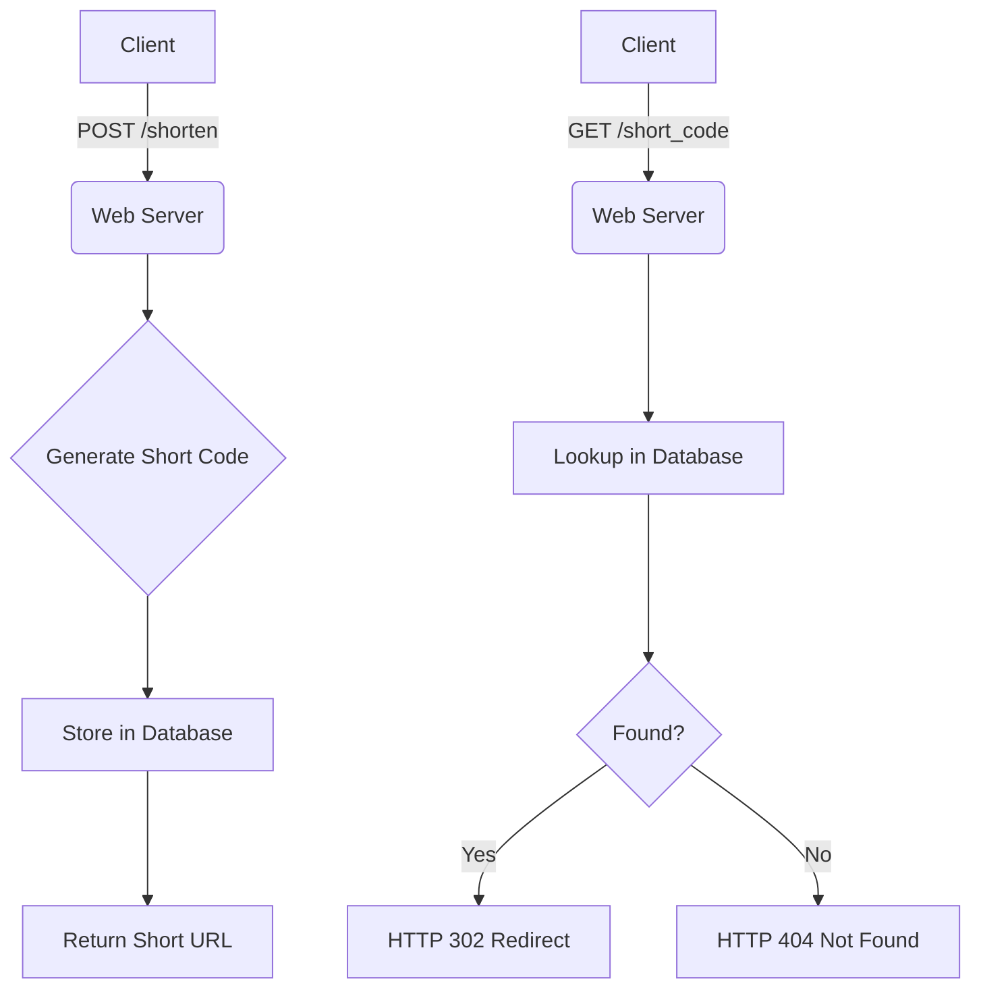

# URL Shortener – System Design Experiment

## Objective
Design, implement, and evaluate a URL redirection system that converts long URLs into short URLs and measure system performance under varying request loads.

## System Design

The system consists of three components:
1. **Client** – Sends requests to shorten or resolve URLs.
2. **Web Server (Flask)** – Handles API requests.
3. **Database (SQLite)** – Stores short code ↔ long URL mappings.

**API Endpoints:**
| Method | Endpoint | Description |
|--------|----------|-------------|
| POST | `/shorten` | Accepts a long URL, returns a short URL |
| GET | `/<short_code>` | Redirects (HTTP 302) to the original URL |

## Flowchart



## Code

```python
@app.route('/shorten', methods=['POST'])
def shorten_url():
    data = request.get_json()
    long_url = data['url']
    short_code = generate_short_code()

    c.execute('INSERT INTO url_map (short_code, long_url) VALUES (?, ?)', (short_code, long_url))
    conn.commit()

    return jsonify({'short_url': f"http://localhost:5000/{short_code}"}), 201

@app.route('/<short_code>')
def redirect_url(short_code):
    c.execute('SELECT long_url FROM url_map WHERE short_code = ?', (short_code,))
    result = c.fetchone()

    if result:
        return redirect(result[0], code=302)
    else:
        abort(404)
```

## Load Test Results

| Metric | Value |
|--------|-------|
| Concurrency | 20 threads |
| Total Requests | 500 |
| Successful Requests | 500 (100%) |
| Requests Per Second | 4.82 |
| Avg Shorten Latency | 2113.09 ms |
| Avg Resolve Latency | 2025.38 ms |

## How to Run

```bash
pip install -r requirements.txt
python app.py
```
In a separate terminal:
```bash
python load_test.py
```
